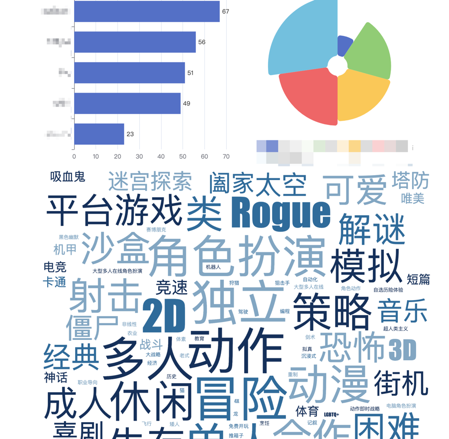
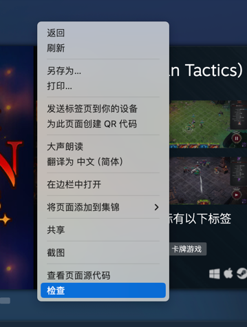
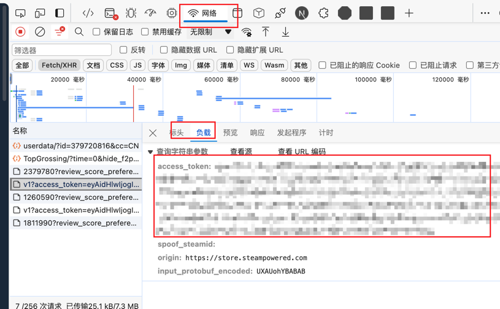
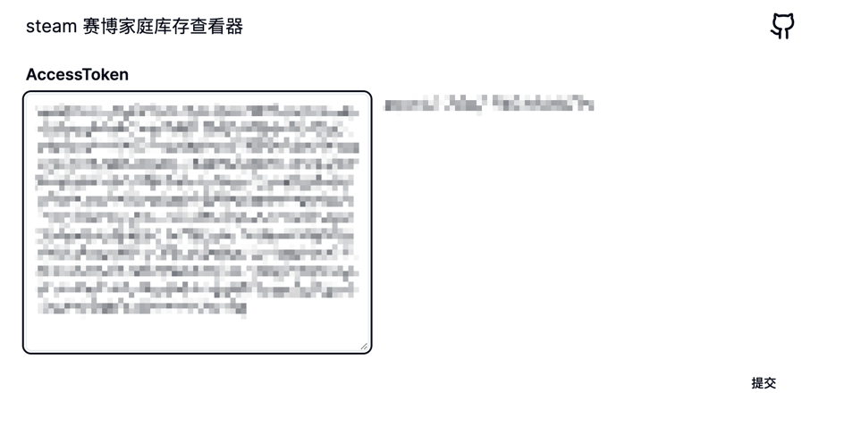
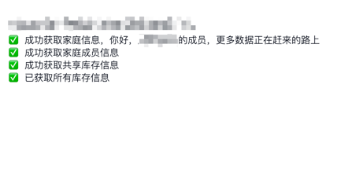
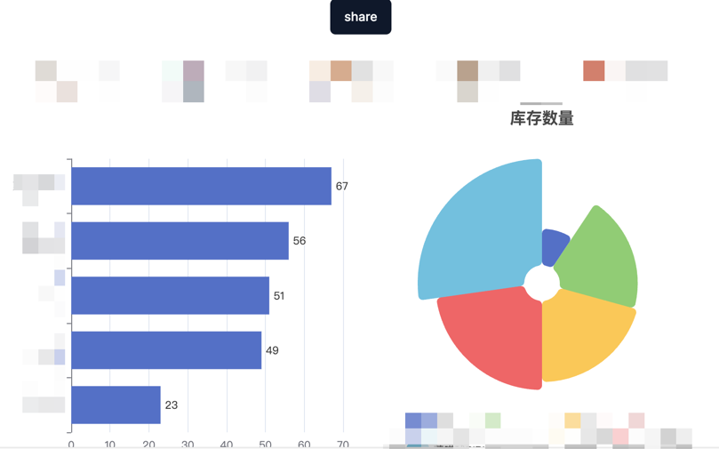

# steam-family-lib-viewer

这是一个获取 steam 家庭共享库存的小玩具。
可以统计一些数据，看看库存成分。
效果如图

## Prerequisites

- 需要一个已加入新版测试家庭的 steam 账号。

## Getting Started

1. 在 web 端登陆 steam。
2. 按下 F12，或右键检查打开调试面板

3.找到类型如图所示带有 access_token的网络请求，复制。

4. 打开本站点，填入access_token

5. 点击提交，不出意外，数据已经开始获取啦。

6. 查看结果

## Deploy
这是用 Next.js 构建的页面，你可很方便的使用 vercel 自行部署。

## Todo
- [ ] more filter
- [ ] more data panel
- [ ] ui improve

## Sponsor
如果觉得这个玩具还不错，可以考虑赞助一杯快乐水哦。

