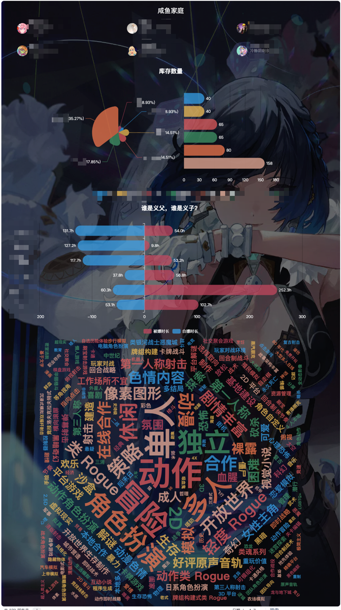
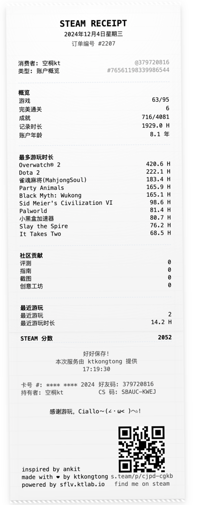
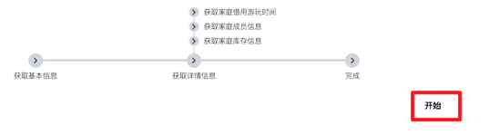
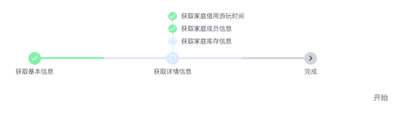

# steam-family-lib-viewer

Steam Summary

最初这是一个获取 steam 家庭共享库存的小玩具，统计一些数据，看看库存成分。 
后面断断续续加上了一些其他功能，如库存分组对比、STEAM RECEIPT。

## 地址
https://sflv.ktlab.io/

https://sflv.vercel.app/

## 功能说明

该工具的大部分功能都需要 `access_token`，因此使用前需要获取`Steam Token`，获取方式[Token.md](./token.md)

### 家庭库存统计
效果如图

#### Prerequisites
- 需要一个已加入新版家庭的 steam 账号。
- 已添加有效的 Token

#### 使用
添加 Token 之后，直接点击开始，即可获取数据。

### 统计分组对比

对比不同账户的库存构成。

该功能暂时不需要 `Token`，只需要 Steam ID 即可获取数据（对应账号的资料应该是可公开访问的）。

### STEAM RECEIPT

受到 [GITHUB RECEIPT](https://github.com/ankitkr0/gitreceipt) 的启发，制作了类似的小玩具。

需要添加Token。
该功能通过爬取 `https://steamcommunity.com/profiles/${id}/games?tab=all` 页面的内容获取数据。
而直接访问该页面需要登录，因此需要添加Token。

添加Token 之后，只需输入 SteamID 即可获取（可以是其他人的，只要资料公开）。

效果如图

## Deploy
这是用 Next.js 构建的页面，你可很方便的使用 vercel 自行部署。

