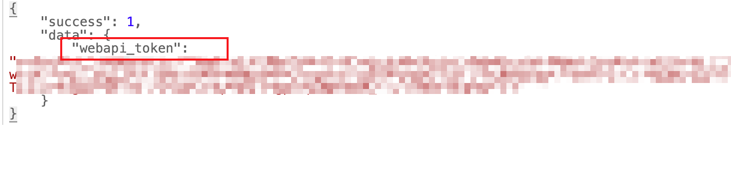

# steam-family-lib-viewer

这是一个获取 steam 家庭共享库存的小玩具。
可以统计一些数据，看看库存成分。
效果如图

## Prerequisites

- 需要一个已加入新版测试家庭的 steam 账号。

## Getting Started

### 1. 在浏览器中登陆 Steam

### 2.1 获AccessToken （控制台方式）
- 按下 F12，或右键检查打开调试面板

- 
- 找到类型如图所示带有 access_token的网络请求，复制。

### 2.2 获取 AccessToken （直接访问请求）

在登陆了 steam 之后直接访问 https://store.steampowered.com/pointssummary/ajaxgetasyncconfig
。提取 `webapi_token` 部分的内容即为 `access_token`

### 3. 打开本站点，填入access_token

### 4. 点击提交，不出意外，数据已经开始获取啦。

### 5.查看结果

## Deploy
这是用 Next.js 构建的页面，你可很方便的使用 vercel 自行部署。

## Todo
- [x] more filter
- [ ] more data panel
- [ ] ui improve

