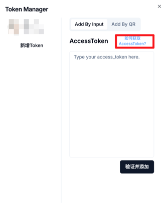
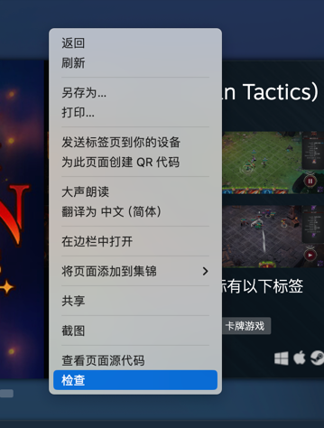
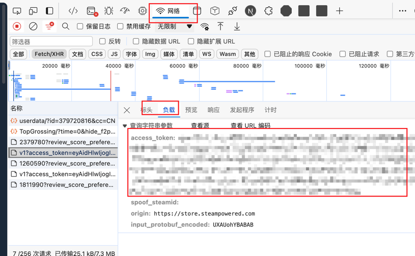
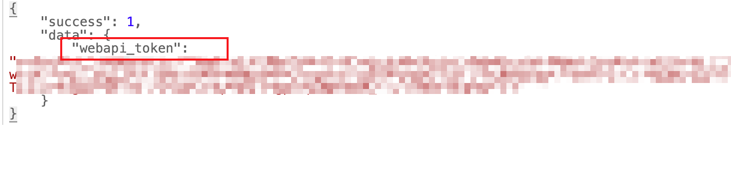
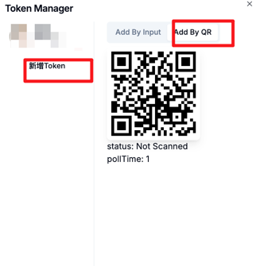

## Token

该工具的大部分功能都需要 `access_token`，本节介绍如何获取 `access_token`。

#### Token 获取

有三种方式获取 Token

##### 获取 AccessToken （直接访问请求）
在浏览器中登陆 Steam：https://store.steampowered.com/ ，登陆之后直接访问 https://store.steampowered.com/pointssummary/ajaxgetasyncconfig 。
提取 `webapi_token` 部分的内容即为 `access_token`。

工具内已提供了相关链接。

##### 获取 AccessToken （控制台方式）
在浏览器中登陆 Steam：https://store.steampowered.com/ ，按下 F12，或右键检查打开调试面板

找到类型如图所示带有 access_token的网络请求，复制。

##### 获取 AccessToken （扫描 QR）
工具内提供了二维码登录，对 steam 网页的登录流程进行了模拟，使用 steam 手机验证器扫描即可。

#### Token 存储

Token 获取之后，所有的 `token` 都存储在浏览器的本地。